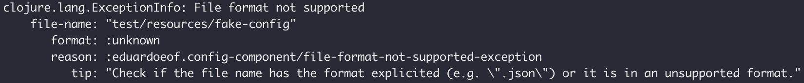

# config-component

A stuartsierra/component for config files in JSON, YAML and EDN formats. Based on the file extension, the component converts the file's content as an edn map and added it on the system-map.

## Latest version

[](https://clojars.org/eduardoeof/config-component)

## Usage

```clj
(ns my.ns
  (:require [eduardoeof.config-component :refer [new-config]]
            [com.stuartsierra.component :as component]))

(def system (component/system-map
              :config (new-config "my-config-file.json"))
```

In the example above, the function `new-config` receives the config file's name and returns a config-component.

```clj
(alter-var-root #'system component/start)
```

After the creation, the config-component will load the file when executed the `component/start`.

### Config files

The config-component can load JSON, YAML and EDN files. In the example below we have a JSON file:

```json
{"db": {
    "host": "localhost",
    "port": 27070,
    "user": "Nina"
}}
```

After the execution of `component/start`, the content of `:config` in the system-map will be:

```clj
{:config
  {:db {:host "localhost"
        :port 27070
        :user "Nina"}
   :file-name "my-config-file.json"}}
```

Important to meation that all keys will be converted as keywords, no matter the format of the file. Also the file name is added in the map as `:file-name`.

### Error

If the config file name doesn't have an extention or the file doesn't exist, an exception will be thrwon:



## License

config-component is available under the MIT license. See the LICENSE file for more info.
